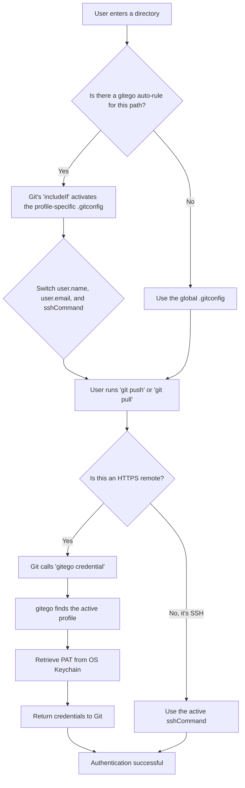

# gitego

**Your Git identity manager and automatic profile switcher.**

`gitego` is a command-line tool designed to completely eliminate the risk of committing to a repository with the wrong user identity. It allows you to define separate profiles for work, personal projects, and clients, and then automatically switch between them based on your working directory.

It seamlessly manages your `user.name`, `user.email`, SSH keys, and Personal Access Tokens (PATs), acting as a unified and intelligent manager for your Git identity.

---

## How gitego helps you

Have you ever accidentally committed to a personal project with your work email? Or pushed to a client's repository with your personal GitHub account? This is a common and often embarrassing problem that can lead to a messy commit history and professional awkwardness.

`gitego` solves this by making identity management an automated, invisible part of your workflow. Instead of you having to remember to switch profiles, `gitego` does it for you based on simple rules you define. It acts as both an automatic switcher and a final safety net, ensuring the right identity is always used for the right project.

## Key features

* **Automatic profile switching:** Configure profiles to activate automatically when you enter a specific directory.

* **Unified identity management:** A single profile can manage your commit author (`user.name`, `email`), your authentication method (`ssh-key`), and your API token (`pat`).

* **True cross-platform support:** Works natively on macOS, Windows, and Linux by integrating with each OS's secure credential store for its internal vault.

* **Git credential helper:** Acts as a proper, robust credential helper for Git, ensuring seamless and secure authentication for `https://` remotes without conflicting with other system tools.

* **Pre-commit safety net:** An optional Git hook warns you if you're about to commit with a mismatched identity, providing a final chance to prevent a mistake.

## Installation

You must have [Go](https://go.dev/dl/) (version 1.21+) installed on your system.

```bash
go install [github.com/bgreenwell/gitego@latest](https://www.google.com/search?q=https://github.com/bgreenwell/gitego%40latest)
```

*(Note: Ensure your Go bin directory, typically `~/go/bin`, is in your system's `PATH`.)*

## One-time setup: Configure Git

After installation, you need to tell Git to use `gitego` as its credential helper. This single command makes `gitego` the source of truth for your HTTPS credentials.

```bash
# Clear any old, conflicting helpers
git config --global credential.helper ""

# Set gitego as the one and only helper, using the required '\!' prefix
git config --global --add credential.helper "\!gitego credential"
```

## Example usage walkthrough

Here’s a typical workflow for setting up and using `gitego`.

#### 1. Add your profiles

First, define your different identities. You can add a simple profile, one with a dedicated SSH key, and one with a Personal Access Token (PAT) for HTTPS authentication.

* **Note:** For profiles that will authenticate with a service like GitHub, it's crucial to provide your login `username` for that service.

```bash
# A simple personal profile

gitego add personal --name "Brandon" --email "brandon.personal@email.com" --username "bgreenwell-personal"

# A work profile that uses a specific SSH key

gitego add work-ssh --name "Brandon Greenwell" --email "brandon.work@company.com" --username "bgreenwell-work" --ssh-key \~/.ssh/id\_work

# A client profile that uses a PAT for HTTPS

gitego add client-abc --name "Brandon G." --email "brandon@client-abc.com" --username "bgreenwell-client" --pat "ghp\_YourClientPATHere"
```

#### 2. List your configured profiles

Use the `list` (or `ls`) command to see all the profiles you've saved.

```bash
gitego list
```

*Expected Output:*
```
PROFILE    &#9;NAME                 &#9;EMAIL                       &#9;USERNAME

-----

client-abc &#9;Brandon G.           &#9;brandon@client-abc.com      &#9;bgreenwell-client
personal   &#9;Brandon              &#9;brandon.personal@email.com  &#9;bgreenwell-personal
work-ssh   &#9;Brandon Greenwell    &#9;brandon.work@company.com    &#9;bgreenwell-work
```

#### 3. Set a global default

The `use` command sets your default global identity for any repositories that don't have a specific rule.

```bash
gitego use personal
```

*Expected Output:*
```
✓ Set active profile to 'personal'.
```

#### 4. Configure automatic switching (the magic)

Now, tell `gitego` which profiles to use for which project directories.

```bash
gitego auto \~/dev/work/ client-abc
gitego auto \~/dev/personal/ personal
```

Let's see it in action.

```bash
# Outside of any managed directory

cd \~

# Initialize a dummy git repo if you don't have one here, for 'status' to work

git init . \>/dev/null 2\>&1
gitego status
```

*Expected Output:*
```
## \--- Git Identity Status --- Name:   Brandon Email:  brandon.personal@email.com Source: Global Git Config
```
```bash
# Now, inside a managed directory
cd ~/dev/work/project-x
git init . # (if it's a new repo)
gitego status
```

*Expected Output:*

```
--- Git Identity Status ---
  Name:   Brandon G.
  Email:  brandon@client-abc.com
  Source: gitego auto-rule for profile 'client-abc' (path: /Users/brandon/dev/work/)
---------------------------
```

Your identity, SSH key, and PAT have all been switched automatically and are ready to use.

#### 5\. Install the safety net

For any repositories that *don't* have an auto-rule, you can install the pre-commit hook as a final safety measure.

```bash
cd ~/dev/some-other-project
git init .
gitego install-hook
```

Now, if you try to commit in this repository with a mismatched profile, `gitego` will warn you and ask you to confirm before proceeding.

## How it works

`gitego` uses two separate, powerful Git mechanisms to achieve its automation:

1.  **For user & SSH switching:** The `gitego auto` command leverages a built-in Git feature called `includeIf`. It creates a profile-specific config file (e.g., `~/.gitego/profiles/work.gitconfig`) containing the correct `user.name`, `user.email`, and `core.sshCommand`, and then tells your main `~/.gitconfig` to only include that file when you are inside the specified directory.

2.  **For PAT & HTTPS authentication:** `gitego` registers itself as Git's **credential helper**. When Git needs to authenticate for an `https://` remote, it calls `gitego credential`. Our tool then determines the correct context (based on auto-rules or the active profile), retrieves the corresponding PAT from your secure OS keychain, and feeds it back to Git. This is the most robust and secure method for HTTPS authentication.

### Visualizing the Workflow



### Security Model

`gitego` is designed with security as a top priority. Here's how it keeps your credentials safe:

  * **No Plaintext PATs:** Personal Access Tokens (PATs) are never stored in plaintext in the configuration file.
  * **Secure OS Keychain:** `gitego` uses the native, secure keychain of your operating system (macOS Keychain, Windows Credential Manager, or the secret-service/dbus on Linux) to store and retrieve your PATs. This is the same secure storage that tools like Docker and other credential managers use.
  * **Scoped Access:** The credential helper only provides a token when Git explicitly requests it for an HTTPS operation. The token is passed directly to Git in memory and is not logged or stored elsewhere.

By leveraging these native OS features and Git's own robust mechanisms, `gitego` provides a seamless and secure way to manage your developer identities.

## Contributing

Contributions are welcome\! Please feel free to open an issue or submit a pull request.

## License

This project is licensed under the MIT License.
