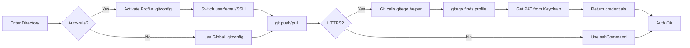

[](https://github.com/bgreenwell/gitego/actions/workflows/go-ci.yml)
[](https://goreportcard.com/report/github.com/bgreenwell/gitego)
[](https://pkg.go.dev/github.com/bgreenwell/gitego)

[](https://github.com/bgreenwell/gitego/releases/latest)
[](https://opensource.org/licenses/MIT)

**Your Git identity manager and automatic profile switcher.**

`gitego` is a command-line tool designed to completely eliminate the risk of committing to a repository with the wrong user identity. It allows you to define separate profiles for work, personal projects, and clients, and then automatically switch between them based on your working directory.

It seamlessly manages your `user.name`, `user.email`, SSH keys, and Personal Access Tokens (PATs), acting as a unified and intelligent manager for your Git identity.

---

## Key features

* **Automatic profile switching:** Configure profiles to activate automatically when you enter a specific directory.
* **Unified identity management:** A single profile can manage your commit author (`user.name`, `email`), your authentication method (`ssh-key`), and your API token (`pat`).
* **True cross-platform support:** Works natively on macOS, Windows, and Linux by integrating with each OS’s secure credential store for its internal vault.
* **Git credential helper:** Acts as a proper, robust credential helper for Git, ensuring seamless and secure authentication for `https://` remotes without conflicting with other system tools.
* **Pre-commit safety net:** An optional Git hook warns you if you’re about to commit with a mismatched identity, providing a final chance to prevent a mistake.

## Installation

You must have [Go](https://go.dev/dl/) (version 1.24+) installed on your system.

```bash
go install github.com/bgreenwell/gitego@latest
````

*(Note: Ensure your Go bin directory, typically `~/go/bin`, is in your system’s `PATH`.)*

## One-time setup: Configure Git

After installation, you need to tell Git to use `gitego` as its credential helper. This single command makes `gitego` the source of truth for your HTTPS credentials.

```bash
# Clear any old, conflicting helpers
git config --global credential.helper ""

# Set gitego as the one and only helper, using the required '\!' prefix
git config --global --add credential.helper "!gitego credential"
```

## Example usage

Here’s a typical workflow for setting up and using `gitego`.

#### 1\. Add your profiles

First, define your different identities.

```bash
# A simple personal profile
gitego add personal --name "Brandon" --email "brandon.personal@email.com" --username "bgreenwell-personal"

# A work profile that uses a specific SSH key
gitego add work-ssh --name "Brandon Greenwell" --email "brandon.work@company.com" --username "bgreenwell-work" --ssh-key ~/.ssh/id_work

# A client profile that uses a PAT for HTTPS
gitego add client-abc --name "Brandon G." --email "brandon@client-abc.com" --username "bgreenwell-client" --pat "ghp_YourClientPATHere"
```

#### 2\. List your configured profiles

Use the `list` (or `ls`) command to see all the profiles you’ve saved.

```bash
gitego list
```

*Expected Output:*

```
ACTIVE  PROFILE     NAME                 EMAIL                       ATTRIBUTES
------  -------     ----                 -----                       ----------
        client-abc  Brandon G.           brandon@client-abc.com      [PAT]
        personal    Brandon              brandon.personal@email.com
        work-ssh    Brandon Greenwell    brandon.work@company.com    [SSH]
```

#### 3\. Set a global default

The `use` command sets your default global identity for any repositories that don’t have a specific rule. This will also update your global `.gitconfig`.

```bash
gitego use personal
```

*Expected Output:*

```
✓ Set active profile to 'personal'.
```

Now, `gitego list` will show the active profile marked with an asterisk:

```
ACTIVE  PROFILE     NAME                 EMAIL                       ATTRIBUTES
------  -------     ----                 -----                       ----------
        client-abc  Brandon G.           brandon@client-abc.com      [PAT]
*       personal    Brandon              brandon.personal@email.com
        work-ssh    Brandon Greenwell    brandon.work@company.com    [SSH]
```

#### 4\. Configure automatic switching

Now, tell `gitego` which profiles to use for which project directories.

```bash
gitego auto ~/dev/work/ work-ssh
gitego auto ~/dev/personal/ personal
```

When you `cd` into `~/dev/work/any-repo`, your `user.name`, `user.email`, and `sshCommand` will be automatically switched to the `work-ssh` profile.

-----

## Use cases

`gitego` solves real-world identity management challenges for developers across various scenarios:

### 🏢 **Professional development**
- **Freelancers/contractors**: Manage separate identities for different clients without credential mix-ups
- **Corporate + side projects**: Keep work, open-source, and consulting identities completely separate
- **Agency work**: Different branding and credentials for each client project

### 🔒 **Security & compliance**
- **Multi-environment access**: Different tokens for dev/staging/production to prevent accidents
- **Audit requirements**: Trackable identities for different types of work (features, hotfixes, reviews)
- **Enterprise security**: Credential isolation mandated by corporate security policies

### 🚀 **DevOps & operations**
- **Multi-cloud management**: Separate credentials for AWS, GCP, Azure environments
- **Infrastructure teams**: Different access levels for different infrastructure components
- **Deployment safety**: Prevent catastrophic deployments due to wrong environment credentials

### 🎓 **Educational & personal**
- **Students**: Separate school, internship, and personal project identities
- **Instructors**: Clean separation between teaching materials and personal work
- **Open source**: Different authority levels as maintainer vs. contributor

### 💡 **Common pain points solved**
- ❌ **Before**: Manual `git config` switching, accidental wrong commits, security breaches
- ✅ **After**: Automatic switching, zero-risk management, professional separation

## Commands

| Command | Alias | Description |
|---|---|---|
| `gitego add <name>` | | Adds a new user profile. |
| `gitego rm <name>` | `remove` | Removes a saved user profile, asking for confirmation. |
| `gitego list` | `ls` | Lists all saved user profiles and their attributes. |
| `gitego use <name>` | | Sets a profile as the active global default. |
| `gitego auto <path> <name>` | | Sets a profile to be used automatically for a given directory path. |
| `gitego status` | | Displays the current effective Git user and the source of the configuration. |
| `gitego edit <name>` | | Edits an existing user profile's attributes. |
| `gitego install-hook` | | Installs a pre-commit hook in the current repo to prevent misattributed commits. |
| `gitego completion <shell>`| | Generates shell completion scripts. |
| `gitego --version` | `-v` | Prints the application version. |

## How it works

`gitego` is built on top of two powerful, native Git features, ensuring it works seamlessly without fighting against Git's own mechanisms.

### Visualizing the workflow



### 1\. Identity switching: `includeIf`

For managing your commit identity (`user.name`, `user.email`) and SSH keys, `gitego` uses a Git feature called conditional includes.

When you run `gitego auto ~/work work-ssh`:

1.  `gitego` creates a small, dedicated config file at `~/.gitego/profiles/work-ssh.gitconfig`.
2.  This file contains only the `[user]` and `[core]` information for that profile.
3.  `gitego` then adds a block to your main `~/.gitconfig` file that looks like this:
    ```ini
    [includeIf "gitdir:~/work/"]
        path = ~/.gitego/profiles/work-ssh.gitconfig
    ```

This tells Git: "if the current repository is inside the `~/work/` directory, merge the settings from this other file." It's a native, fast, and highly reliable way to switch contexts.

### 2\. Authentication: credential helper

For handling Personal Access Tokens (PATs) with HTTPS remotes, `gitego` acts as a **Git credential helper**.

1.  **Configuration**: The `git config --global credential.helper '!gitego credential'` command tells Git that whenever it needs a username or password for an `https://` URL, it should run the `gitego credential` command.
2.  **Execution**: When you run `git push` or `git pull` on an HTTPS remote, Git executes `gitego credential` in the background and pipes it the protocol, host, and path information.
3.  **Context Resolution**: The `gitego credential` command uses the same logic as `gitego status`: it checks the current working directory to find the active profile via auto-rules or the global default.
4.  **Secure Retrieval**: It then fetches the corresponding PAT for that profile from your operating system's native, secure keychain (macOS Keychain, Windows Credential Manager, or Linux Secret Service).
5.  **Response**: Finally, it prints the username and PAT to standard output, which Git reads to complete the authentication.

### Security model

`gitego` is designed with security as a top priority. Here's how it keeps your credentials safe:

  * **No Plaintext PATs:** Personal Access Tokens (PATs) are never stored in plaintext in the configuration file.
  * **Secure OS Keychain:** `gitego` uses the native, secure keychain of your operating system to store and retrieve your PATs. This is the same secure storage that tools like Docker and other credential managers use.
  * **Scoped Access:** The credential helper only provides a token when Git explicitly requests it for an HTTPS operation. The token is passed directly to Git in memory and is not logged or stored elsewhere.

By leveraging these native OS features and Git's own robust mechanisms, `gitego` provides a seamless and secure way to manage your developer identities.

## Contributing

Contributions are welcome\! Please feel free to open an issue or submit a pull request.

## License

This project is licensed under the MIT License.